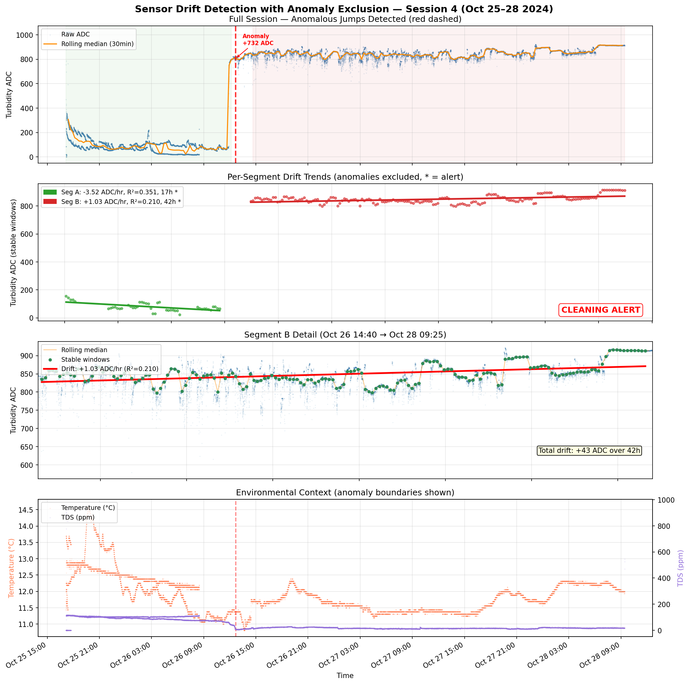

# Sensor Drift Study

Detection of biofouling-induced sensor drift in DFRobot SEN0189 turbidity sensor data from a UK river deployment (Oct 2024).

## Key Findings

- **Dataset:** 50,338 cleaned readings across 4 sessions over 20 days (6-second sample interval)
- **1 anomalous jump detected:** +732 ADC at Oct 26 12:40 (environmental regime shift, not fouling)
- **2 stable segments** identified after excluding the anomaly:

| Segment | Period | Duration | Drift | Total | R² |
|---------|--------|----------|-------|-------|----|
| A (pre-jump) | Oct 25 17:10 → Oct 26 12:10 | 17h | -3.52 ADC/hr | -61 ADC | 0.351 |
| B (post-jump) | Oct 26 14:40 → Oct 28 09:25 | 42h | +1.03 ADC/hr | +43 ADC | 0.210 |

- **Segment A** shows a downward drift (sensor settling after deployment — disturbed sediment clearing)
- **Segment B** shows a steady upward drift under stable conditions — consistent with **biofilm accumulation** on the optical window attenuating the IR signal
- **Cleaning alert triggered** for both segments (threshold: 0.5 ADC/hr)

## Method

1. Cleaned raw CSV: fixed header mismatch, removed temperature spike artifacts, tagged 4 recording sessions
2. Computed hourly medians and detected anomalous jumps (>150 ADC between consecutive hours)
3. Segmented data around jumps with 2-hour cooldown to let signal settle
4. Within each segment, computed 30-minute rolling windows with 50% overlap
5. Filtered for "stable" windows (temperature stdev < 0.3°C, TDS stdev < 15 ppm, turbidity stdev < 60 ADC)
6. Fitted linear drift trend to stable-window medians per segment

## Files

| File | Description |
|------|-------------|
| `drift_detection.py` | Experiment script (run with `python drift_detection.py`) |
| `drift_detection.png` | 4-panel output: full session with anomalies, per-segment drift, detail zoom, environmental context |
| `data01_clean.csv` | Cleaned input data (50,338 rows, 4 sessions) |

## Output

- **Panel 1:** Full session — raw ADC with rolling median, anomalous jump marked (red dashed), segments shaded
- **Panel 2:** Per-segment drift trends — stable windows only, anomaly excluded
- **Panel 3:** Segment B detail — zoomed view of the 42-hour high-turbidity plateau with drift trendline
- **Panel 4:** Environmental context — temperature and TDS confirm conditions were stable during drift (not environmental)
